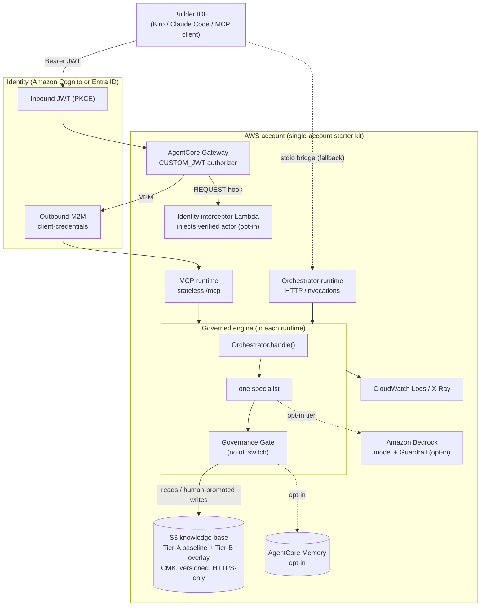

<!-- Copyright Amazon.com, Inc. or its affiliates. All Rights Reserved. -->
<!-- SPDX-License-Identifier: MIT-0 -->

# System Overview & Architecture — Governed Agentic Companion

This document describes the architecture of the Governed Agentic Companion starter kit: the
component topology on Amazon Bedrock AgentCore, the three-tier execution model, the request/
governance data flow, and the design principles that keep it safe by construction. It is the
companion reference to [`GOVERNANCE.md`](GOVERNANCE.md) (how the boundary is enforced),
[`SECURITY.md`](SECURITY.md) (the security model), and [`COST.md`](COST.md).

## Intended audience

- **Builder / ProServe teams** forking the kit to stand up a governed assistant for an engagement.
- **Security and compliance reviewers** who must approve an autonomous AI component before it is
  used in production-adjacent work.
- **Platform engineers** wiring the companion into Amazon Bedrock AgentCore and their IdP.

Readers should be comfortable with AWS IAM, Amazon Cognito (or an OIDC IdP), containers, and the
Model Context Protocol (MCP). Familiarity with Amazon Bedrock AgentCore is helpful but not required.

## Objectives

After reading this document, you will be able to:

- Explain the component topology and where the trust boundaries sit.
- Trace a request from an IDE front door through the governance gate to a grounded answer.
- Identify which controls are deterministic (verified) versus advisory (exploration).
- Locate the code that owns each responsibility, so you can fork and replace it safely.

## Architecture overview

The companion is a governed **team of agents** whose guardrails are code, not prompts. A single
**Orchestrator** classifies each request and routes it to exactly one **specialist**; every
response — from any path — passes through one always-on **Governance Gate** before a caller ever
sees it. The engine answers **deterministically with no LLM in the path** by default; two optional
LLM tiers add depth and remain gated.

The kit runs in three postures, all sharing the same engine and gate:

| Posture | What runs | AWS needed |
|---|---|---|
| **Local CLI** | `./run.sh status \| ask \| gate` | none (no AWS, no LLM) |
| **Local MCP bridge** | IDE → stdio bridge → deployed runtime | AgentCore runtime + identity |
| **Gateway (production)** | IDE → AgentCore Gateway (JWT) → MCP runtime | full `agentcore/terraform/` stack |

### Architecture diagram



*Every response leaves the engine only through the gate. A human runs every AWS mutation
(Tenet 1); the gateway, interceptor, memory, and model tier are independent opt-ins.*

### Architecture diagram (described)

The deployed (gateway) topology, with numbered callouts:

1. **Front door.** A builder's IDE (Kiro, Claude Code, or any MCP client) presents a JWT minted
   by the identity provider (Amazon Cognito by default, or Microsoft Entra ID). The token is
   auto-refreshed by the front-door helpers (`frontdoor/gateway_token.py`).
2. **AgentCore Gateway.** Validates the inbound JWT with a `CUSTOM_JWT` authorizer scoped to the
   allowed client ids, then brokers to the upstream MCP server. Its own outbound hop to the
   runtime uses an OAuth2 M2M (client-credentials) credential from AgentCore Identity.
3. **Identity interceptor (opt-in, ADR-0001 Phase 2).** A REQUEST interceptor Lambda derives the
   verified builder subject from the already-validated JWT and injects it (`X-Gac-Actor-Sub`) into
   the forwarded request, so per-builder memory attributes to a real, verified actor. It is
   invocable only by the gateway service principal.
4. **MCP runtime.** A stateless streamable-HTTP `/mcp` face on Amazon Bedrock AgentCore Runtime —
   the gateway's target. It wraps the same governed engine as the orchestrator runtime.
5. **Orchestrator runtime.** An HTTP `/invocations` face on AgentCore Runtime for the direct
   (stdio-bridge) path. Both runtimes share one least-privilege execution role.
6. **The engine + gate.** Inside each runtime: `Orchestrator.handle()` → one specialist →
   `gate_output()`. Governance is preserved by construction — there is no path that returns an
   un-gated response.
7. **Knowledge base.** A locked in-repo **Tier-A** baseline plus an optional **Tier-B** overlay
   read from Amazon S3 (`kb/curated/overlay.json`), which fails open to the baseline. The bucket
   is private, CMK-encrypted, versioned, HTTPS-only, and access-logged.
8. **Memory (opt-in).** Amazon Bedrock AgentCore Memory backs per-builder session Events and a
   summarization strategy for cross-builder recall. Ready infrastructure — a fork wires its engine
   to it (`GAC_MEMORY_ID`).
9. **Model tier (opt-in).** When a tier is enabled, the runtime invokes an Amazon Bedrock model
   (region-scoped IAM) and, optionally, applies an Amazon Bedrock Guardrail on each write.
10. **Observability.** Amazon CloudWatch Logs (scoped to `/aws/bedrock-agentcore/runtimes/*`),
    X-Ray active tracing on the interceptor, and `bedrock-agentcore`-namespaced metrics.

### Design principles

The architecture aligns with the AWS Well-Architected Framework:

- **Safety by construction (Security).** The two absolute tenets — human-owned deployment (T1) and
  bounded agency (T3) — are enforced at the action layer (read-only tools/credentials + permission
  boundaries), not by prompt. The gate is a second, observability layer. There is no off switch.
- **Grounded reasoning (Reliability).** Factual recall runs deterministically with no LLM in the
  path, so it cannot hallucinate. LLM tiers are optional and blocked below a measured grounding bar.
- **Least-privilege isolation (Security).** One shared runtime execution role with narrowly scoped,
  region-bound grants; per-component roles for the gateway and interceptor; CMK encryption for the
  knowledge base and the M2M secret.
- **Operational excellence.** Every response carries a governance-outcome footer (tenets checked,
  measured confidence, sources, gate status). Integrity of the constitution is SHA-256 verified at
  startup.
- **Progressive complexity (Cost / Sustainability).** The kit runs with zero cloud footprint;
  memory, gateway, guardrail, and model tiers are each independent opt-ins, so you pay only for
  what an engagement needs. See [`COST.md`](COST.md).

## Component structure

| Component | Responsibility | Code / IaC |
|---|---|---|
| Orchestrator | Classify a request, route to one specialist | `agents/orchestrator.py` |
| Governance Gate | Always-on, deterministic output enforcement (no off switch) | `agents/governance_gate.py` |
| Specialists | Domain answers over a common contract (measured confidence + sources) | `agents/specialists/` |
| Knowledge base | Tier-A locked baseline + Tier-B S3 overlay (fails open) | `knowledge/`, `agents/kb_overlay.py` |
| Data-protection guard | Reject secrets / redact PII+proprietary on every KB/memory write (T6) | `agents/data_protection.py` |
| Evidence gateway (opt-in) | Provenance packet that can only TIGHTEN the gate | `agents/evidence_gateway.py` |
| Runtimes | HTTP `/invocations` + stateless MCP `/mcp` faces | `agentcore/app/`, `runtimes.tf` |
| Gateway + interceptor | JWT front door + verified-identity propagation | `gateway.tf`, `interceptor.tf`, `agentcore/interceptor/` |
| Identity | Cognito (or Entra ID) pool + clients + M2M credential | `cognito.tf`, `secrets.tf` |
| Front doors | Local stdio bridge, gateway HTTP, Claude plugin, onboarding | `frontdoor/`, `plugin/`, `onboarding/` |

## Operating model — ReAct, operated by a human (HITL)

The companion's core loop is **ReAct (Reasoning + Acting)**, but the "acting" is deliberately
bounded and the human is the operator, not a bystander:

- **Reason:** the engine classifies the request, routes to a specialist, and reasons over the
  knowledge base (Tier-A + Tier-B), citing sources.
- **Act (produce, don't execute):** the only "action" the engine takes is producing a
  **review-ready artifact** — an answer, a plan, a config, a command to run, a diff to apply. It
  never deploys, applies, promotes, restarts, or writes a system of record.
- **Human decides (HITL):** the human reads the reasoning + the governance footer, judges it, and
  takes the real-world action if they agree. Every decision point is human-owned — a deployment
  (Tenet 1), a knowledge promotion (Tenet 8), any system-of-record change (Tenet 3).

This is why the governance gate and the trust zones exist: they are the machinery that keeps the
"act" side bounded so a human can safely operate the loop. **The human uses the tool; the tool does
not act on the world.** Accountability for the outcome stays with the human.

## Three-tier execution model

- **Tier 1 — deterministic (always on).** Rule/knowledge-based; no LLM dependency. This is the
  **verified zone**: grounded by construction, reproducible, no per-response confidence heuristic.
- **Tier 2 — local LLM (Ollama, opt-in).** For depth without leaving the host.
- **Tier 3 — cloud LLM (Amazon Bedrock, opt-in).** Resilient: retries with backoff and a circuit
  breaker that degrades to Tier 1 under sustained failure (`config.yaml` → `llm.resilience`).

Tiers 2/3 are the **exploration zone**: non-deterministic, treated as a claim to verify. The gate
blocks an exploration-zone answer below the `grounding.fact_threshold` (default 0.95); a
verified-zone answer is grounded by construction and not subject to the heuristic.

## Request & governance data flow

```
IDE / CLI
  → (gateway path) AgentCore Gateway validates JWT → interceptor injects verified actor
  → runtime: Orchestrator.handle(prompt)
      → classify → one specialist
          → Tier 1 deterministic answer (or Tier 2/3 if enabled + grounded)
          → (writes to KB/memory pass agents/data_protection.py — T6)
      → gate_output()  ── BLOCK ─→ withhold text, return block notice
                        └─ PASS ─→ answer + governance-outcome footer
  → caller
```

The gate hard-blocks any answer that claims a deployment/mutation happened (T1), claims a write to
a read-only system of record (T3), leaks secret material (T6), or is an ungrounded exploration-zone
guess below the bar (T4). See [`GOVERNANCE.md`](GOVERNANCE.md) for the full detector table.

## Trust boundaries

- **Front door ↔ gateway:** the IdP-issued JWT (inbound authorizer).
- **Gateway ↔ runtime:** OAuth2 M2M client-credentials; the interceptor's injected actor is trusted
  ONLY on the gateway path (a direct caller cannot forge it — ADR-0001).
- **Runtime ↔ AWS:** one least-privilege, region-scoped execution role.
- **Engine ↔ knowledge:** writes pass the data-protection guard; Tier-A is never overlaid from S3.

## Deployment

The full stack is Terraform under [`../agentcore/terraform/`](../agentcore/terraform/) — a human
runs `terraform apply` (Tenet 1). See [`DEPLOY.md`](DEPLOY.md) for the ordered walkthrough and
[`../agentcore/terraform/README.md`](../agentcore/terraform/README.md) for the resource inventory
and inputs. For a production multi-account topology, the security and auth patterns here align with
the AWS *Guidance for Enterprise Agentic AI Platform on AWS*, so the step up is incremental.

## Related resources

- [`GOVERNANCE.md`](GOVERNANCE.md) — the always-on gate, detectors, integrity.
- [`SECURITY.md`](SECURITY.md) — security model + accepted security debt.
- [`COST.md`](COST.md) — cost considerations and a sample estimate.
- [`../PRINCIPLES.md`](../PRINCIPLES.md) — the 13-tenet constitution.
